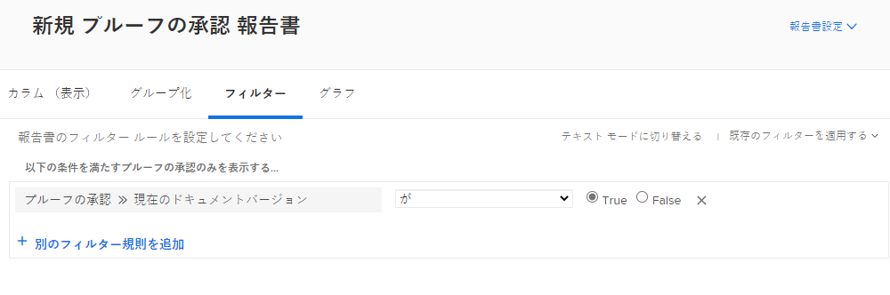
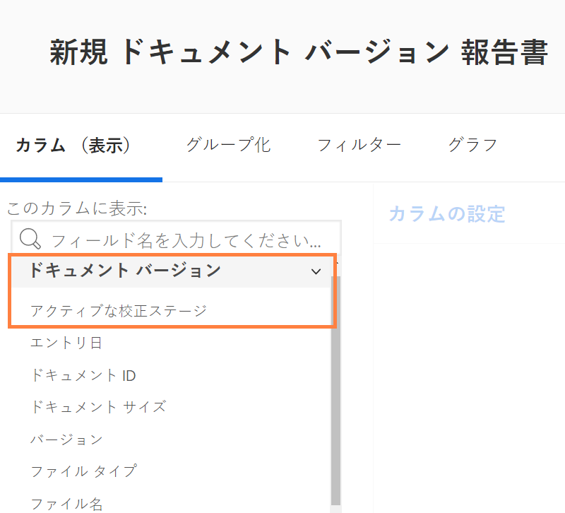
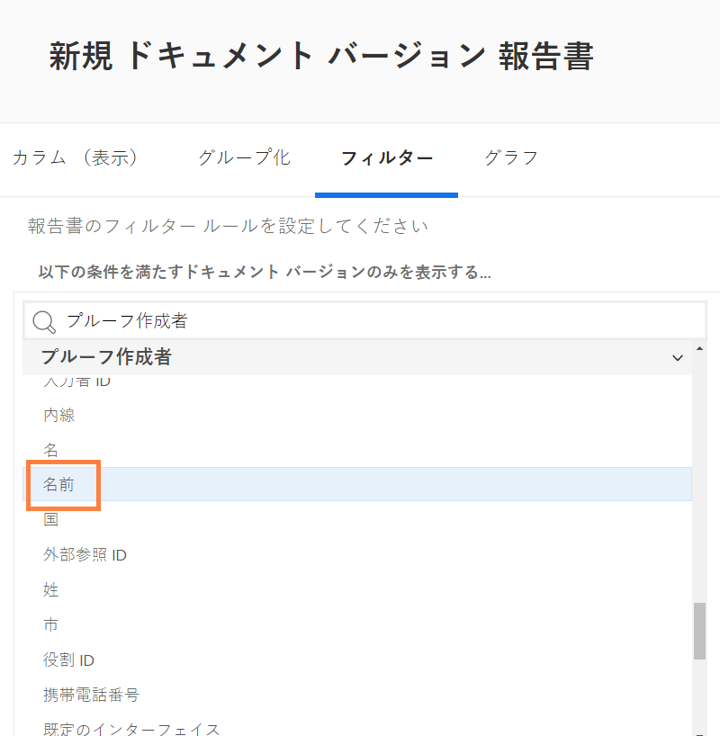

# プルーフに関するレポート

[!DNL Workfront]のデジタル校正機能を使用すると、プロジェクトと関連するレビューワークフローを 1 か所で管理できます。 [!DNL Workfront]. レビューおよび承認情報を表示するレポートタイプ、フィールドソース、フィールド名を使用して行なわれるプルーフ作業に関する有益な情報を得ます。

を [!DNL Workfront] コンサルタントに問い合わせて、組織の要件を満たすレポートを作成してもらいます。 一部のレポートでは、 [!DNL Workfront]のテキストモードレポート。

これらの基本的で標準的なレポートから始めて、チームが [!DNL Workfront] のレビューと承認プロセスを経たプルーフを管理できるようにします。

## [!UICONTROL プルーフの承認]

このレポートタイプを使用すると、未処理のプルーフの承認を追跡して、期限を満たしていることを確認できます。

![[!UICONTROL 新しいレポート]ドロップダウンメニューから「[!UICONTROL プルーフの承認]」を選択する](assets/proof-system-setups-proof-approval-report.png)

表示およびフィルターのオプションには、[!UICONTROL 決定日]、[!UICONTROL プルーフの承認]、[!UICONTROL 承認者ステージ]、[!UICONTROL ワークフローテンプレート]、[!UICONTROL 依頼者情報]が含まれます。テキストモードのレポートを使用すると、ドキュメント名でリストを整理するグループ化を作成できます。詳しくは、 [グループ化の基本的なテキストモードを理解する](https://experienceleague.adobe.com/docs/workfront-learn/tutorials-workfront/reporting/intermediate-reporting/basic-text-mode-for-groupings.html?lang=en).

配達確認の承認レポートを作成する場合は、配達確認の最新バージョンに関する情報を取得していることを確認してください。 [!DNL Workfront] では、このフィールドのソースとフィールド名をフィルターに含めることをお勧めします。

**[!UICONTROL プルーフの承認]／[!UICONTROL 現在のドキュメントのバージョン]**

これは、複数のバージョンを持つ配達確認のレポートで、承認が必要な各配達確認の現在のバージョンのみがレポートに表示されるようにする場合に役立ちます。 これにより、作業する必要がなくなった以前のバージョンが除外されます。

## [!UICONTROL ドキュメント バージョン]

このレポートタイプを使用すると、[!DNL Workfront] でバージョンを管理および追跡することができます。

![[!UICONTROL 新しいレポート]ドロップダウンメニューから「[!UICONTROL ドキュメントバージョン]」を選択する](assets/proof-system-setups-document-version-report.png)

表示オプションには、[!UICONTROL ドキュメントバージョン]、[!UICONTROL ドキュメント]、[!UICONTROL 入力者]、[!UICONTROL プルーフ承認ステータス]、 [!UICONTROL プルーフ作成者]、[!UICONTROL ドキュメント提供者]の情報が含まれます。

グループ化は、[!UICONTROL ドキュメントバージョン]、[!UICONTROL 入力者]、[!UICONTROL プルーフ承認ステータス]、プルーフ所有者情報によって行うことができます。

フィルターには、[!UICONTROL ドキュメントバージョン]、[!UICONTROL アクセスレベル]、[!UICONTROL ドキュメント]、[!UICONTROL 入力者]、[!UICONTROL プルーフ承認ステータス]、[!UICONTROL プルーフ作成者]、ドキュメント提供者の情報が含まれます。

ビューのこの列を使用して、レポートの各ドキュメントで現在アクティブなプルーフステージの名前を表示できます。

**[!UICONTROL ドキュメントのバージョン]／[!UICONTROL アクティブなプルーフステージ]**

現在アクティブなステージがない場合、列は空白になります。

このフィールドソース >>フィールド名は、レポートのフィルターとしても使用できます。

「[!UICONTROL プルーフ作成者]」フィールドソースを使用して、プルーフを作成したユーザーに関する情報をレポートします。ビューにプルーフ作成者の名前を表示するには、[!UICONTROL 名前]フィールドソースを選択します。

**[!UICONTROL プルーフの作成者]／[!UICONTROL 名前]**

このフィールドソース／フィールド名の組み合わせは、フィルターとしても使用できます。

<!--
Learn More Icon
Learn how to create reports in [!DNL Workfront] with the Report Creation class.
Access to proofing functionality
-->
