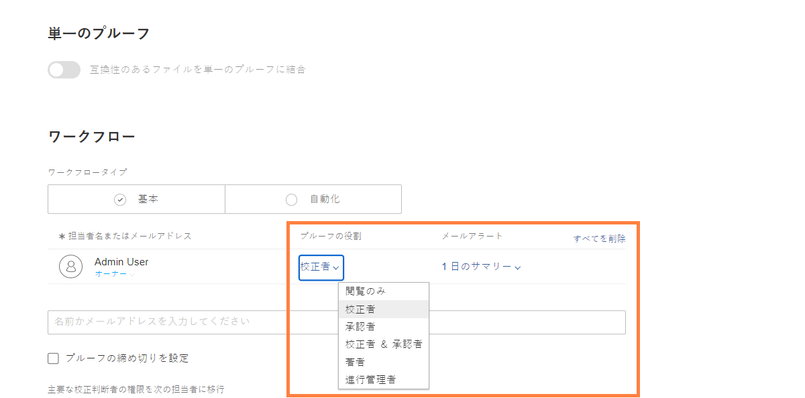
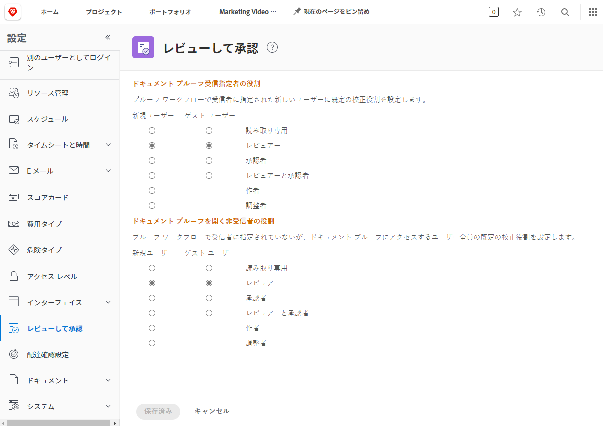

# デフォルトのプルーフの役割を設定

<!---
21.4 updates have been made
--->

最初に実施するデフォルト設定は、新しいユーザーが作成されたときや、ユーザーがプルーフを開いたときに割り当てられる、デフォルトのプルーフの役割を決定することです。

プルーフの役割に応じて、プルーフでユーザーが実行できる操作が定まります。プルーフの確認のみ、コメントの作成、プルーフの承認などです。[!DNL Workfront] では、すべてのユーザーに対してプルーフの役割のデフォルトを設定し、プルーフへの受信者の追加やワークフローの設定を迅速かつ容易に行えるようにすることをお勧めします。

ただし、このデフォルトのプルーフの役割を変更できるのは、個々のプルーフをアップロードするときです。これにより、レビューと承認プロセスで誰もが必要な役割を果たせるようにします。

## デフォルトのプルーフの役割を設定

1. [!UICONTROL メインメニュー]から「**設定**」を選択します。
1. 左側のメニューから「**レビューと承認**」を選択します。
1. 「指定受信者」の新規 [!DNL Workfront] ユーザーとゲストプルーフユーザーの両方に対して、希望するデフォルトのプルーフの役割の横にあるボタンをクリックします。指定受信者は、手動またはワークフローテンプレートによってプルーフワークフローに追加されたユーザーです。
1. 「非受信者」の新規 [!DNL Workfront] ユーザーとのゲスト プルーフ ユーザーの両方に対して、希望するデフォルトのプルーフの役割の横にあるボタンをクリックします。非受信者は、通常、プルーフへアクセスできるユーザーで、ワークフローに割り当てられていない [!DNL Workfront] のユーザーです。
1. 変更を保存します。

ユーザーとゲストのほとんどが、プルーフワークフローに追加された場合に何をする必要があるかを検討します。 これがデフォルトになります。
