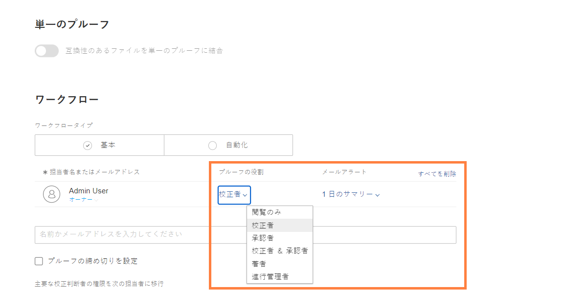
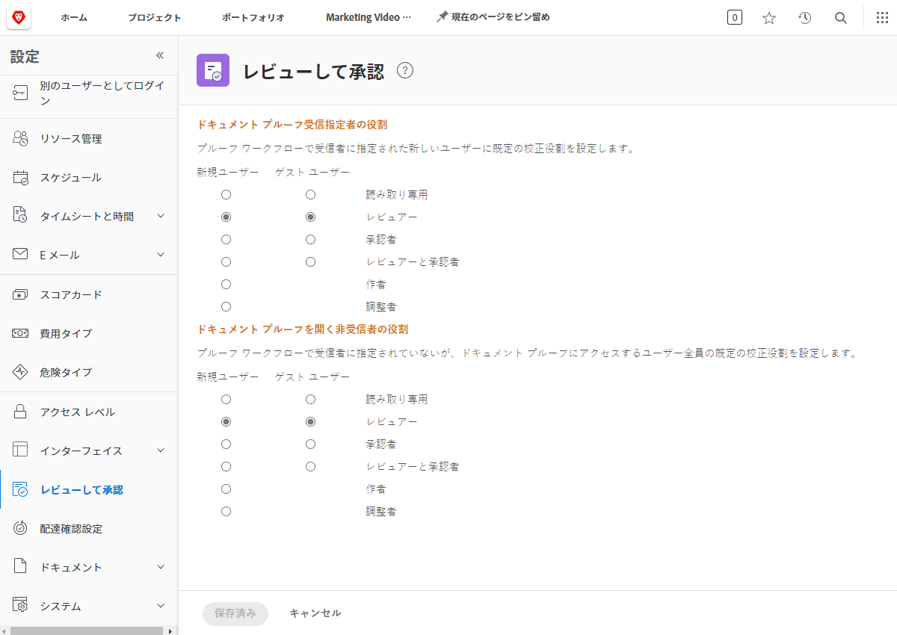

# デフォルトのプルーフの役割を設定

最初に実施するデフォルト設定は、新しいユーザーが作成されたときや、ユーザーがプルーフを開いたときに割り当てられる、デフォルトのプルーフの役割を決定することです。

プルーフの役割は、ユーザーがプルーフで何ができるかを決定します。プルーフを見て、コメントを作成し、承認するだけです。[!DNL Workfront]では、すべてのユーザーに対してプルーフの役割のデフォルトを設定し、受信者をプルーフに追加してワークフローを迅速かつ簡単に設定することを推奨しています。

ただし、このデフォルトのプルーフの役割を変更できるのは、個々のプルーフをアップロードするときです。これにより、レビューと承認プロセスで誰もが必要な役割を果たせるようにします。

## デフォルトのプルーフの役割を設定

1. [!UICONTROL メインメニュー]から「**設定**」を選択します。
1. 左側のメニューから「**レビューと承認**」を選択します。
1. 「指定受信者」の新規 [!DNL Workfront] ユーザーとゲストプルーフユーザーの両方に対して、希望するデフォルトのプルーフの役割の横にあるボタンをクリックします。指定受信者は、手動またはワークフローテンプレートによってプルーフワークフローに追加されたユーザーです。
1. 「非受信者」の新規 [!DNL Workfront] ユーザーとゲストプルーフユーザーの両方で、希望するデフォルトのプルーフの役割の横にあるボタンをクリックします。 非受信者は通常、プルーフへアクセスできるユーザーで、ワークフローに割り当てられていない [!DNL Workfront] のユーザーです。
1. 変更を保存します。

ユーザーとゲストのほとんどが、プルーフワークフローに追加された場合に何をする必要があるかを検討します。 これがデフォルトになります。

## ベストプラクティス

| ベストプラクティス | その理由は次のとおりです |
|---|---|
| Workfront の「ドキュメントプルーフを開く非受信者の役割」設定には、読み取り専用またはレビュアーのみを使用します。 | この設定の他のオプションはすべて、プルーフ決定を行う必要があり、プルーフワークフローに影響を与える可能性があります。 一般に、プルーフワークフローに追加されていない人物は、プルーフを実際に承認する必要はなく、プルーフを表示したりコメントを付けたりするだけなので、「読み取り専用」または「レビュアー」オプションが最適です。   メモ：この設定は、Workfront メインメニュー／設定／レビューと承認にあります。 |
