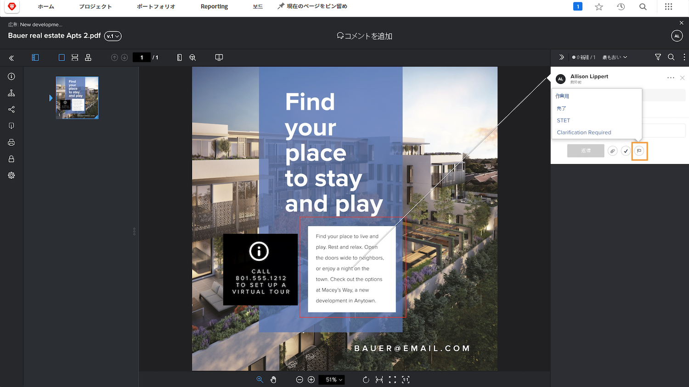
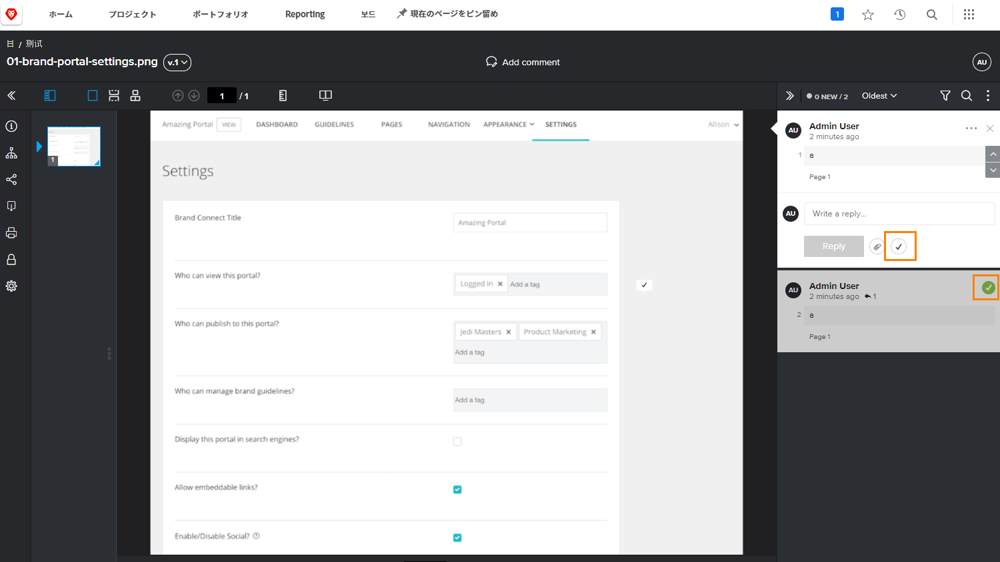

# プルーフのコメントの管理

[!DNL Workfront] は、アセットを修正するなど、プルーフの各コメントに関連する作業を、コメントアクションを使用したり、コメントを解決したりすることで、追跡および管理するのに役立ちます。

プルーフのアクションはコメントに付けられた「フラグ」または「ラベル」で、多くの場合、コメントに関してアクションが実行されたことや、実行する必要があることを示すために使用されます。アクションは、各コメントのアイコンまたは「その他」メニューから選択できます。

例えば、レビュープロセス中に行われた修正のうち、どれを実際に反映させるべきかを決定する責任があるとします。アクションを使用して、関連するコメントにマークを付けることで、デザイナーやエディターにどの修正を反映するかを知らせることができます。その後、そのユーザーは別のアクションを使用して、変更が加えられたことを示せます。

![プルーフビューア内のプルーフの画像。コメント上で「[!UICONTROL やること]」プルーフアクションがハイライト表示されています。](assets/manage-comments-2.png)

コメントにアクションが表示されない場合は、組織がアクションを設定していません。アクションは組織で使用するべきものだと考える場合は、プルーフシステム管理者に相談してください。

「コメントを解決」機能は一般的に、修正の反映や質問への回答など、コメントが何らかの方法で対処されたことを示すために使用されます。[!DNL Workfront] のユーザーによっては、修正を反映する必要がない場合や、単なるコメントを確認した場合に、コメントを「解決」します。

チェックマークアイコンをクリックして、コメントを解決します。するとコメントに緑のチェックマークが付けられます。これにより、コメント列にざっと目を通す際に、どのコメントが確認済みかを簡単に特定できます。

これらの機能のいずれでもコメント列をフィルタリングできるので、プルーフに関する作業をする時に、表示される内容を調整するのに役立ちます。

![プルーフビューア内のコメントフィルターの画像。「[!UICONTROL アクション]」および「[!UICONTROL 一般]」のフィルタリングオプションがハイライト表示されています。](assets/manage-comments-3.png)

## やってみよう

>[!IMPORTANT]
>
>プルーフのワークフローに割り当てられた同僚には、プルーフを操作しているのは Workfront のトレーニングの一環であることを忘れずに伝えてください。

1. Workfront にアップロードしたプルーフを検索します。プルーフビューアを開き、作成されたコメントを確認し、コメントに返信します。完了したら、プルーフビューアを閉じます。
1. Workfront でアップロードしたプルーフに対する最新のコメントを確認するには、「ドキュメントの詳細」または「概要」パネルの「アップデート」セクションを使用します。コメントに返信します。

<!--
## Learn more
* Create and manage proof comments
-->
