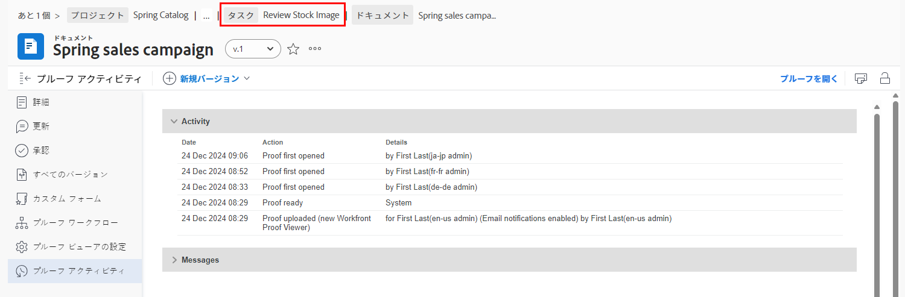

# 配達確認の詳細を理解する

## 配達確認の詳細を表示

配達確認の管理者または所有者は、概要パネルと [!UICONTROL ドキュメントの詳細] ページ。 まず、 [!UICONTROL ドキュメント] プロジェクト、タスク、またはイシューのセクション。

### 概要パネル

概要パネルには、配達確認の基本的な詳細の概要が表示されます。 アイコンを使用して必要なときにパネルを展開し、必要でないときにパネルを折りたたみます。配達確認のサムネールの上にマウスポインターを置いて、配達確認を開いたりダウンロードしたりすることもできます。

![画像 [!UICONTROL ドキュメント] 配達確認を選択し、概要パネルを展開したプロジェクトの「 」セクション。 概要パネルのアイコンと概要パネルの両方がハイライト表示されます。](assets/document-summary.png)

注意：この [!UICONTROL 承認] 概要パネルのセクションは、 **文書** 承認および **等しくない** は、このコースで学習した配達確認のレビューと承認プロセスに関連しています。 2 つのプロセスは、 [!DNL Workfront].

### [!UICONTROL ドキュメントの詳細]

配達確認に関する詳細情報が必要な場合は、 [!UICONTROL ドキュメントの詳細] リンクをクリックすると、 [!DNL Workfront].

![の配達確認のページの画像 [!DNL  Workfront].](assets/document-details.png)

校正プロセスに関連する情報を表示する機能は、 [!DNL Workfront].

配達確認のページの左側のパネルメニューから、次のセクションにアクセスできます。

* **更新 —** 配達確認ビューアでおこなわれたコメントが、「配達確認のコメント」タグ付きでここに表示されます。 タスクやプロジェクトにコメントを付ける場合と同様に、ファイルにコメントを付けることもできます（これらのコメントは配達確認ビューアには表示されません）。
* **承認 —** このセクションは、文書の承認用であり、承認用ではありません。 2 種類の承認は、 [!DNL Workfront] とはリンクしないでください。 レビューと承認に配達確認ワークフローを使用する場合、このセクションは使用しません。
* **すべてのバージョン —** 配達確認のバージョン履歴を追跡および管理します。 この情報には、 [!UICONTROL ドキュメント] リスト。
* **カスタムForms —** カスタムフォームは、組織固有の情報を取り込むために配達確認に対して使用されます。 この情報は、ファイルと共に統合ドキュメントストレージシステムに渡すことができます。例えば、 [!DNL Workfront] DAM または [!DNL Adobe’s] AEM. カスタムフォームは [!DNL Workfront] システム管理者またはグループ管理者。 配達確認でカスタムフォームを使用するかどうかについては、チームまたは管理者に問い合わせてください。
* **校正ワークフロー —** 配達確認に割り当てられたワークフローを管理または変更します。 このウィンドウを開くには、 [!UICONTROL 校正ワークフロー] 内の配達確認に関するリンク [!UICONTROL ドキュメント] リストにも含まれます。 配達確認の編集ワークフローのビデオを使用して、ワークフローに変更を加える方法を説明します。

次の 2 つの節を詳しく見てみましょう。 [!UICONTROL 校正ビューアの設定] および [!UICONTROL 校正アクティビティ].

### [!UICONTROL プルーフ ビューアの設定]

これらの設定は、配達確認自体へのアクセスを制御するのに役立ちます。

![画像 [!UICONTROL 校正ビューアの設定] を [!UICONTROL 校正ビューアの設定] オプションがハイライト表示されています。](assets/proofing-settings-on-details-page.png)

* **[!UICONTROL ログインが必要. この配達確認はゲストユーザーと共有できません] —** 配達確認は、 [!DNL Workfront] ライセンスの検証。
* **[!UICONTROL 決定を電子署名する必要がある] —** 配達確認を共有する場合は、受信者に [!DNL Workfront] また、配達確認を決定する際に、校正用のパスワードを入力することで、配達確認の「電子署名」を行います。 ( 注意：校正用のパスワードが、 [!DNL Workfront] パスワード。 校正用パスワードに容易にアクセスできないので、ほとんどの受信者はこのパスワードを知りません。) [!DNL Workfront] は、 [!DNL Workfront] コンサルタントに問い合わせてから、この機能を使用してください。
* **[!UICONTROL すべての必要な決定がおこなわれたら配達確認をロックする ]—** これにより、配達確認に関するすべての決定がおこなわれると、それ以上のコメント、返信、決定などに対して配達確認がロックされます。 これにより、校正ワークフローの特定の段階だけでなく、配達確認のバージョン全体がロックされます。
* **[!UICONTROL 元のファイルのダウンロードを許可] —** 配達確認受信者は、校正ビューアから配達確認の元のソースファイルをダウンロードできます（このオプションは右側のパネルメニューにあります）。
* **[!UICONTROL 公開 URL または埋め込みコードを使用した配達確認の共有を許可] —** 配達確認受信者は、誰とでも公開アクセス可能な配達確認リンクを共有できます。
* **[!UICONTROL パブリック URL または埋め込みコードを使用した配達確認の購読を許可] —** パブリック URL を送信したユーザーは誰でも、E メールアドレスと名前（配達確認ユーザーでない場合）または E メールアドレスと校正パスワード（校正ユーザーの場合）を使用して、自分自身を配達確認に追加できます。 ( 注意：校正パスワードが [!DNL Workfront] パスワード )

これらの設定は、配達確認が [!UICONTROL 配達確認の設定] 」セクションに表示されます。

![画像 [!UICONTROL 配達確認の設定] 」セクションをクリックします。](assets/proof-settings-on-upload-page.png)

### [!UICONTROL 校正アクティビティ]

このページは、配達確認で発生したすべてのアクティビティと、この配達確認に関して送信された E メールメッセージを追跡します。

![画像 [!UICONTROL 校正アクティビティ] 」セクションに [!UICONTROL 校正アクティビティ] オプションがハイライト表示されています。](assets/proofing-activity-in-details.png)

この [!UICONTROL アクティビティ] セクションのタイムスタンプ（コメントと決定がおこなわれた場合）およびそれらを作成したユーザー。 また、受信者が最初に配達確認を開始したとき、および配達確認マネージャーや所有者が知りたいその他の情報について、校正ワークフローステージの開始時を追跡します。 これらの詳細は、例えば、校正ワークフローのステージが開始されない理由などを把握する場合に役立ちます。

この [!UICONTROL メッセージ] 「 」セクションのタイムスタンプ。E メールのアラートとメッセージが、誰が送信した受信者に送信されたか、およびメッセージの内容に関する情報が含まれます。 これは、配達確認に関する E メールを受信しなかったというユーザーの言葉を受け取った場合に、トラブルシューティングに役立ちます。 E メールが送信されたかどうかとタイミングを確認できます。

[!DNL Workfront] では、配達確認マネージャーと配達確認の所有者が、この 2 つの節の情報に慣れていることをお勧めします。 この情報を組み合わせて、 [!UICONTROL SOCD] プログレスバーを使用すると、校正ワークフローの場所に関係なく、配達確認を真に理解し、管理できます。

の作業が完了したら、 [!UICONTROL ドキュメントの詳細] 」セクションで、パンくずリストを使用して [!UICONTROL ドキュメント] 配達確認が添付されるプロジェクト、タスクまたは問題のセクション。

<!--
#### Learn more
* [!UICONTROL Document details] overview
* Add a custom form to a document
* Request document approvals
* Summary for documents overview
* View activity on a proof within [!DNL Workfront]
-->
