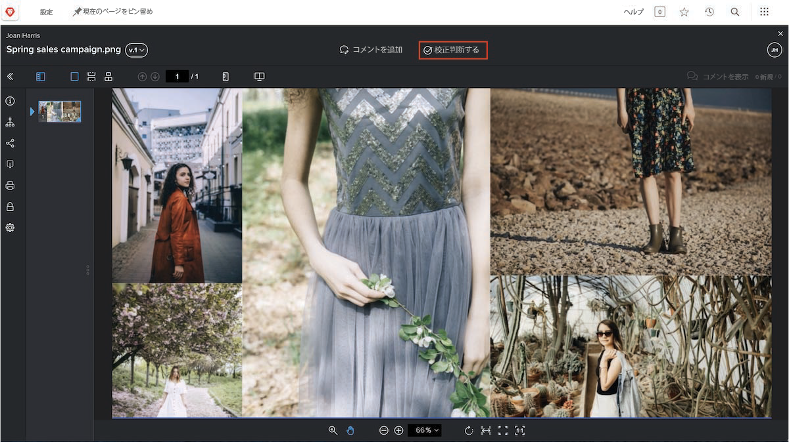
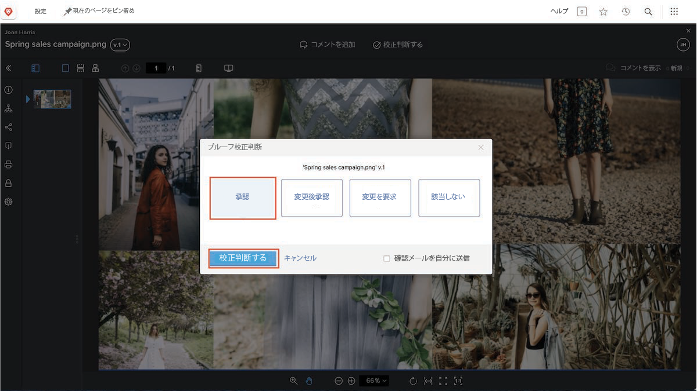

# プルーフの確認と承認

プルーフの確認を始める前に、自分に何が期待されているかを把握します。プルーフワークフローでのあなたの役割は何ですか？ プルーフの確認、プルーフの承認、またはその両方ですか？

コピーエディターであれば、文法上の誤りやスペルミスの校正が焦点となるでしょう。マーケティングチームやクリエイティブチームであれば、アセットのデザインに焦点を当て、企業のブランディングに従っているかを確認することもできます。法務チームであれば、サービス契約の文言に間違いがないかを確認するでしょう。また、プロジェクトマネージャーであれば、レビュー対象のコンテンツが、関連付けられているプロジェクトの意図と目標を満たしているかを確認できます。

また、プルーフの承認を求められる場合もあります。プルーフを承認するということは、「この作業は問題ありません。先に進めてください」と宣言することを意味します。あるいは、「この作業は手直しが必要です。差し戻して修正してください」と言う必要が出る場合もあります。

自身に何が期待されているかがわかれば、プルーフの確認に取り掛かることができます。

## 確認するプルーフの受信

アセットの確認と承認の準備が整うと、メール通知が届きます。

![[!DNL  Workfront] で 2 つのプルーフの確認と承認を求める新しいプルーフメール](assets/new-proof-emails.png)

このプルーフのリンクは、あなたに固有のものであることに注意が必要です。リンクを他のユーザーと共有すると、そのユーザーが行ったコメントやマークアップには、あなたの名前が付けられます。

[!UICONTROL 新しいプルーフ]メールには、プルーフに関する重要な情報も含まれています。

* プルーフ名はメールの件名です。
* サムネールがあるので、確認する内容をすばやく把握できます。
* バージョン番号によって、どのバージョンのプルーフを参照するかを把握できます。
* さらに、重要なこととして、期限がメール内の 2 か所に表示されます。プルーフの詳細セクションのすぐ上と、自分が属しているワークフローステージの灰色のバーです。

確認を開始する準備ができたら、青色の「[!UICONTROL プルーフに移動]」ボタンをクリックするだけで、ファイルが [!DNL Workfront] プルーフビューアで自動的に開きます。

### [!UICONTROL ホーム]からプルーフを開く

[!DNL Workfront] で作業しているとき、プルーフの承認依頼を受けていれば、[!DNL Workfront] [!UICONTROL ホーム]の[!UICONTROL 作業リスト]に割り当てが表示されます。[!UICONTROL フィルター]から「[!UICONTROL 承認]」だけを選択すると、その種類の作業に集中できるので便利です。

![[!UICONTROL 承認]フィルターを使用してリストからプルーフが選択されている [!DNL Workfront] [!UICONTROL ホーム]の画像](assets/open-proof-from-home.png)

プルーフが [!DNL Workfront] [!UICONTROL ホーム]に表示されるのは、承認するように割り当てられている場合のみです。プルーフの確認のみを求められている場合は、フィルターリストから「[!UICONTROL 承認]」を選択しても、[!DNL Workfront] [!UICONTROL ホーム]には表示されません。

[!UICONTROL ワークリスト]でプルーフの承認を選択し、「[!UICONTROL プルーフに移動]」リンクをクリックしてプルーフビューアを開きます。

組織のプルーフとプロジェクトのワークフローによっては、プルーフの承認リクエストの代わりに、[!DNL Workfront] [!UICONTROL ホーム]にタスクの割り当てが表示される場合があります。この場合は、タスク自体の[!UICONTROL ドキュメント]セクションからプルーフを開きます（手順については以下を参照）。

チームや組織向けに [!DNL Workfront] ダッシュボードを特別に作成して、確認するプルーフをそのダッシュボードで見つけるようにすることで、プルーフワークフローの管理を支援することもできます。

### プルーフをプロジェクト、タスクまたはイシューから開く

通常、[!DNL Workfront] でプロジェクト、タスク、またはイシューを処理している場合は、そのアイテムの [!DNL Documents] セクションから直接プルーフを開くのがよいでしょう。

![[!DNL  Workfront] タスクで見つかった「[!UICONTROL ドキュメント]」セクションで「[!UICONTROL プルーフを開く]」リンクが強調表示されているところを示す画像。](assets/open-proof-from-documents.png)

1. プロジェクト、タスク、またはイシューの名前をクリックします。
2. アイテムのページの左側のパネルメニューで「[!UICONTROL ドキュメント]」をクリックします。
3. [!UICONTROL ドキュメント]リストでプルーフを見つけます。
4. 「[!UICONTROL プルーフを開く]」リンクをクリックして、プルーフビューアを開きます。

## プルーフの承認方法

プルーフを開くと、上部の「**コメントを追加**」の横に「**決定する**」ボタンが表示されます。このプルーフの承認者でない場合は、このボタンは表示されません。

決定を行う準備が整ったら、「**決定する**」ボタンをクリックして、決定オプションを確認します。選択肢を選択してから、下にあるもう 1 つの「**決定する**」ボタンをクリックします。

## プルーフの確認と承認

このビデオでは、次の方法を学習します：

* プルーフを確認する際に求められる事項を把握する
* プルーフにコメントする
* プルーフに必要な変更をマークアップで示す
* プルーフのコメントに返信する
* プルーフを承認または却下する

>[!VIDEO](https://video.tv.adobe.com/v/335141/?quality=12&learn=on&enablevpops)

<!--
#### Learn more
* Create and manage proof comments
* Make decisions on a proof
* Review a static proof
* Tag users to share a proof
* Notifications for proof comments and decisions
-->

<!--
#### Guides
* Reviewing proofs in [!DNL Workfront]
* -->
