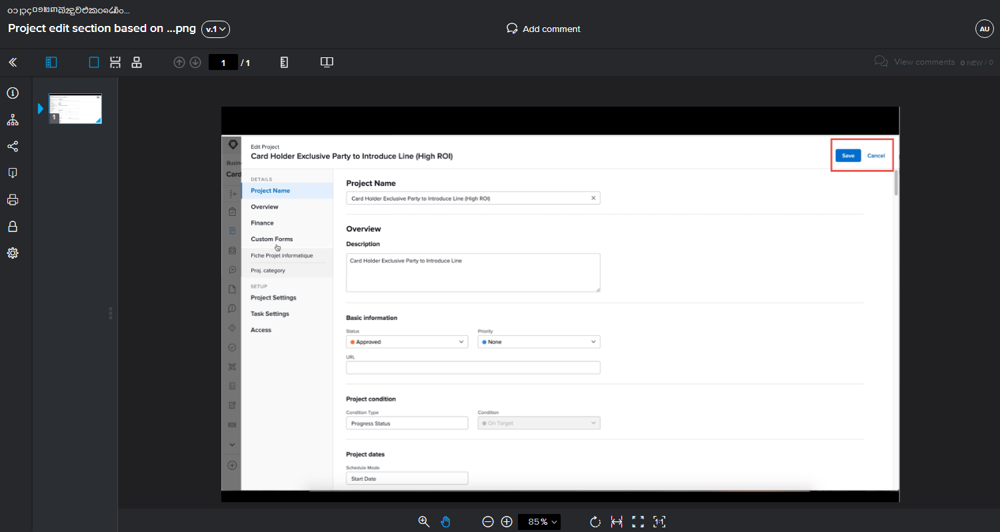
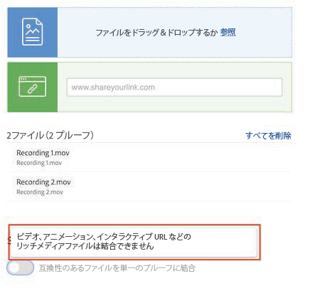

# 複数ファイルを単一プルーフに結合

複数のファイルを 1 つのプルーフに結合することで、多くの場合、プルーフプロセスをより効率的に実行できます。

「結合」オプションは、個々のファイルが関連しているか、成果物全体の一部であり、すべてのファイルを同じ期限までに同じ担当者がレビューする必要がある場合に役立ちます。

例えば、クリエイティブチームが小冊子をデザインしたとします。4 人のデザイナーが複数のページを作成し、別々の PDF として保存しました。各デザイナーがこれらを別々のプルーフとしてアップロードした場合、レビュー担当者は 4 つの異なるプルーフを確認することになります。さらに、小冊子の断片を合わせるのも難しくなります。

解決策：すべての PDF を誰か 1 人がアップロードし、アップロード時にそれらを 1 つのプルーフに結合します。これにより、レビュー担当者は、分断された断片ではなく、小冊子全体を確認できます。

プルーフを結合するには：

1. プルーフを添付する必要があるプロジェクト、タスク、イシューの「[!UICONTROL ドキュメント]」セクションを開きます。
1.  **新規追加／プルーフ**&#x200B;をクリックします。
1. アップロードエリアにファイルをドラッグ＆ドロップするか、ファイルを参照します。[!DNL Workfront] では、最大 50 個のファイルを結合できます。
1. **1 つのプルーフ**&#x200B;の下で、「互換性のあるすべてのファイルを 1 つのプルーフに結合する」のオプションをオンに切り替えます。
1. 結合したプルーフの名前を入力します。このフィールドは必須です。
1. 必要に応じて、アップロードリストのドラッグ＆ドロップで、ファイルを結合する順序を変更できます。
1. プルーフ受信者の追加、期限の設定などを行います。
1. 「[!UICONTROL プルーフを作成]」をクリックしてアップロードを完了します。

![アップロードされたファイルのリストと[!UICONTROL 単一のプルーフ]セクションが強調表示された、[!UICONTROL 新しいプルーフ]ウィンドウの画像](assets/combine-proofs.png)

プルーフがアップロードされると、「[!UICONTROL ドキュメント]」タブに ZIP ファイルとして表示されます。

結合ファイルを表示するには、他に何も必要ありません。通常通り「[!UICONTROL プルーフを開く]」をクリックするだけで、プルーフビューアにプルーフが表示されます。

## ビデオファイルの結合はどうですか？

申し訳ありませんが、ビデオ、アニメーション、インタラクティブ URL などのリッチメディアファイルがリストに含まれている場合、ファイルを結合することはできません。

## やってみよう

>[!IMPORTANT]
>
>Workfront のトレーニングの一環としてプルーフを送信することを、同僚に忘れずに伝えてください。

コンピューターで 3 つか 4 つのファイル（PDF、テキストファイルなど）を検索します。

1. Workfront で実践的な演習に使用しているプロジェクト、タスク、イシューを開きます。
1. ファイルを 1 つのプルーフに結合してアップロードします。
1. リスト内の最後のファイルをリストの最初に移動して、ファイルの順序を調整します。
1. 選択したワークフロー（基本または自動）を割り当てて、アップロードを完了します。

<!--
##Learn more
* Create a multi-page proof
-->
