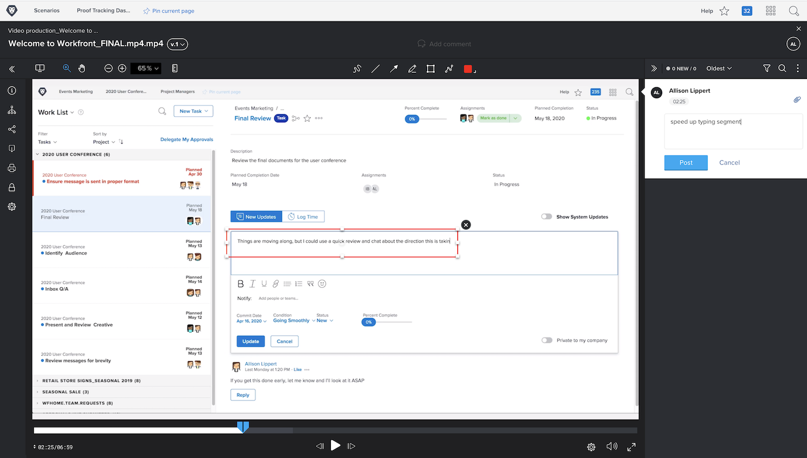

# ビデオのプルーフのアップロード

[!DNL Workfront’s] のプルーフ機能は、PDF、スプレッドシート、画像などの静的なファイルだけを対象としたものではありません。 [!DNL Workfront] は、最大 4GB のビデオや web キャプチャを含む、150 を超えるタイプのファイルをサポートしています。

サイズの大きいファイルは、アップロードに時間がかかることに注意が必要です。 大きなサイズのアップロードを開始する前に、インターネット接続が安定していることを確認してください。通信障害があるとアップロードプロセスが終了する可能性があるからです。

<!-- For a complete list of uploadable file types, see the article, Supported proofing file types. -->

[!DNL Workfront’s] のプルーフビューアは、ビデオファイルを確認して承認するのに最適な場所です。 プルーフの受信者は、プルーフビューアでビデオを直接再生できます。 コメントにはタイムスタンプが付くので、コメントがビデオのどの部分を参照しているかが正確にわかります。 プルーフの受信者は、マークアップツールを使用して、一時停止されたビデオに直接描画することもできます。

サポートされるビデオのタイプは、MOV、MP4、H.264 です。<!-- Check the supported file types list to make sure the video type you use is compatible with Workfront’s proofing features.-->

[!DNL Workfront] でのビデオのアップロードは、静的ファイルのアップロードと同じ手順に従います。

* ビデオをアップロードする先のプロジェクト、タスク、またはイシューを開きます。
* 左のパネルメニューから「[!UICONTROL **ドキュメント**]」を選択します。
* 「[!UICONTROL **新規追加**]」ボタンから「[!UICONTROL **プルーフ**]」を選択します。
* ビデオファイルをアップロードエリアにドラッグ＆ドロップするか、参照機能を使用します。
* 基本ワークフローまたは自動ワークフローを割り当てます。
* 期限を設定します。
* 「[!UICONTROL **プルーフを作成**]」をクリックして終了します。

## やってみよう

>[!IMPORTANT]
>
>Workfront のトレーニングの一環としてプルーフを送信していることを、同僚に伝えることを忘れないでください。

ビデオファイルがある場合は、Workfront の練習プロジェクト、タスクまたはイシューにアップロードします。 通常使用するワークフローに似た基本ワークフローまたは自動ワークフローを適用するか、既に実際のワークフローわかっている場合はそれを適用します。

