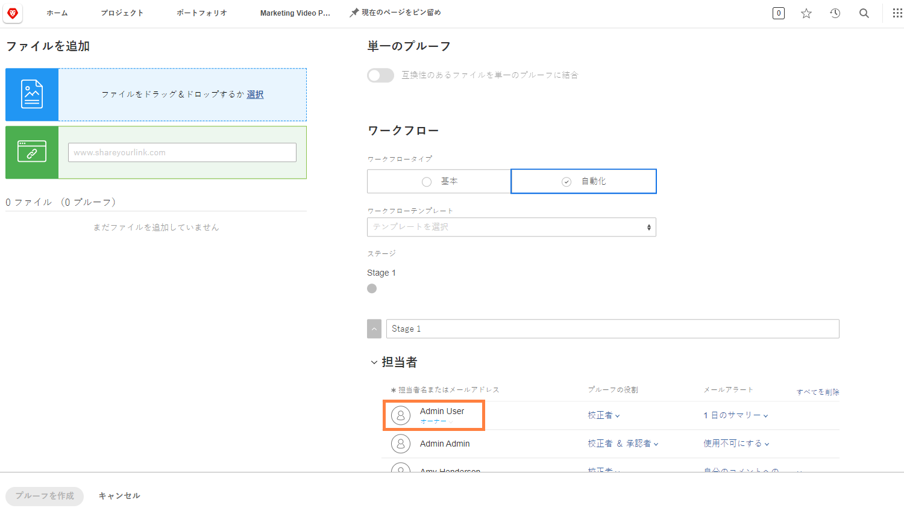

# 自動ワークフローでのプルーフのアップロード

このビデオでは、次のことを学習します。

* 自動プルーフワークフローが使用できるタイミング
* プルーフテンプレートを使用してワークフローを適用する方法
* 自動ワークフローを最初から設定する方法

>[!VIDEO](https://video.tv.adobe.com/v/335133/?quality=12&learn=on)

## 追加のプルーフワークフローの設定

プルーフのアップロードウィンドウの下部にある設定はオプションなので、組織に問い合わせて、プルーフを使用しているかどうかと、どのように使用しているかを確認してください。

![[!UICONTROL ステージ設定]がハイライト表示された[!UICONTROL 新しいプルーフ]ウィンドウの画像。](assets/additional-proof-workflow-settings.png)

* **[!UICONTROL ステージをロック] -**&#x200B;これにより、このワークフローのステージの人物は、ワークフローのステージが完了した後にコメントを作成したり、決定を変更したりできなくなります。
* **[!UICONTROL 主な決定権限の転送先] -**&#x200B;主な意思決定者を指名することで、プルーフプロセスを迅速に実行します。設定すると、[!DNL Workfront] ではこのユーザーによるプルーフ決定を THE 決定として認識します。 そのユーザーが決定を行ったら、ステージは終了し、それ以上決定は必要ありません。
* **[!UICONTROL このステージで 1 つの決定のみが必要] -**&#x200B;プルーフプロセスを効率化するもう 1 つの方法は、プルーフでの決定を 1 つだけにすることです。これをオンにすると、そのステージに承認者の数に関わらず、承認者のいずれかが決定を行ったら、そのステージは完了です。
* **[!UICONTROL このステージをプライベートにする] -**&#x200B;デフォルトでは、プルーフに関するコメントはすべてのステージで全員に表示されます。チェックボックスをオンにして、他のステージのプルーフ受信者がこのステージで作成されたコメントを表示できないようにします。

プルーフのアップロードウィンドウの下部には、プルーフを表示するためにログインをリクエストするなど、プルーフのセキュリティに影響するプルーフ設定が複数あります。

<!--
Learn more about these in the Proof settings section of the Configure a proof article.
-->

![プルーフのアップロードウィンドウの「[!UICONTROL プルーフ設定]」セクションの画像。](assets/additional-proof-workflow-settings-2.png)

<!--
### Learn more
* Automated workflow overview
* Automated workflow stages overview
-->

<!--
### Guides
* Plan an advanced workflow worksheet
-->

## プルーフワークフローを使用している理由

あなたがプルーフ受信者のリストに表示されているのは、そのプルーフをアップロードしたからです。プルーフをアップロードしたユーザーはそのプルーフの所有者にもなり、プルーフに対する編集権限が付与され、ワークフローの設定を変更したり、新しいバージョンをアップロードしたりできます。

あなたはプルーフのアップロードのみを行い、ワークフローは別のユーザーが管理する場合は、[!UICONTROL 所有者]リンクをクリックして名前を入力することで、プルーフの所有者を変更できます。この操作は、元のアップローダ以外のユーザーがバージョンをアップロードする場合にお勧めします。

## やってみよう

>[!IMPORTANT]
>
>Workfront のトレーニングの一環としてプルーフを送信することを、同僚に忘れずに伝えてください。

詳細ワークフローでプルーフをアップロードします。組織で既にプルーフテンプレートが設定されている場合は、チームで使用したものを選択してから、いくつかの調整を行います。

* メールアラートを調整して、プルーフでアクティビティが発生した際に誰にも通知されないようにします。
* 最初のステージには、2 人のレビュアー／承認者が必要です。
* 2 番目のステージには、レビュアー／承認者を 1 人だけ設定する必要があります。

組織でプルーフテンプレートをまだ作成していない場合は、2 ステージのワークフローを最初から設定します。

* 自分とお気に入りの同僚を最初のステージに割り当てます。
* 最初のステージの期限は、プルーフが作成されてから 1 日とします。
* 別のお気に入りの同僚を 2 番目のステージに割り当てます。
* 最初のステージの期限が過ぎたら、ステージを開始します。
* このステージのユーザーに対して、レビューを完了するのに 2 日間与えますが、レビューが正午までに完了する必要があります。

